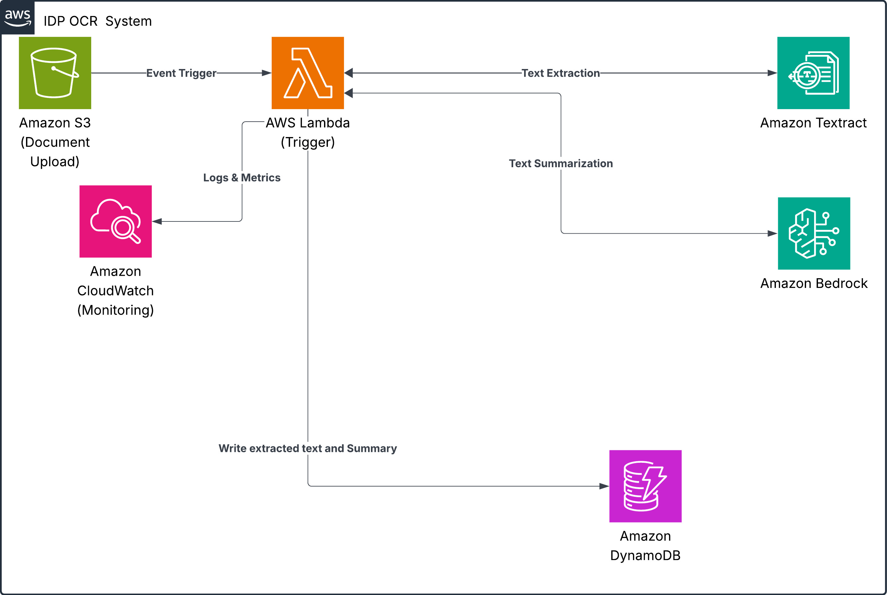

# IDC OCR Document Processing System

A document processing system that automatically extracts text from uploaded documents and generates AI-powered summaries using AWS services.

## Architecture Overview



### System Flow
```
Document Upload → S3 Event → Lambda Function
                                   ↓
                       Document Metadata Extraction
                                   ↓
                   AI Text Extraction (Bedrock Data Automation)
                                   ↓
                        AI Summarization (Bedrock)
                                   ↓
                         Data Storage (DynamoDB)
                                   ↓
                            Logging (CloudWatch)
```

## Features

- **Automatic Processing**: Document upload triggers immediate processing
- **Multi-Format Support**: Handles PDFs, images, and text documents
- **AI-Powered OCR**: Extracts text from images and scanned documents using AWS Bedrock Data Automation
- **Intelligent Text Extraction**: Uses Claude 3 Sonnet with vision capabilities for advanced document processing
- **AI Summarization**: Generates intelligent summaries using AWS Bedrock (Claude 3)
- **Serverless Architecture**: Fully managed AWS services with automatic scaling
- **Cost Effective**: Pay-per-use pricing model
- **Monitoring**: CloudWatch logging and metrics

## Project Structure

```
idc-ocr/
├── docs/                          # Documentation and diagrams
│   ├── idp-ocr.jpeg              # System architecture diagram
│   └── architecture.md           # Detailed architecture documentation
├── infra/                         # Infrastructure as Code
│   ├── terragrunt.hcl            # Main Terragrunt configuration
│   └── terraform/                # Terraform modules
│       ├── main.tf               # AWS resources
│       ├── variables.tf          # Input variables
│       ├── outputs.tf            # Output values
│       └── versions.tf           # Provider versions
├── src/                          # Source code
│   └── lambda/                   # Lambda functions
│       └── document_processor/   # Document processing function
│           ├── lambda_function.py # Main Lambda handler
│           └── requirements.txt  # Python dependencies
├── scripts/                      # Deployment and utility scripts
│   ├── deploy.sh                 # Deploy infrastructure
│   ├── destroy.sh                # Destroy infrastructure
│   └── test.sh                   # Test deployed system
├── README.md                     # This file
└── .gitignore                    # Git ignore patterns
```

## System Components

### Infrastructure (Terragrunt/Terraform)
- **S3 Bucket**: Secure document storage with versioning and encryption
- **DynamoDB Table**: NoSQL database for storing document metadata and summaries
- **Lambda Function**: Serverless processing engine
- **IAM Roles**: Secure access permissions
- **CloudWatch**: Logging and monitoring

### Application (Python)
- **Document Processing**: AI-powered multi-format text extraction using Bedrock Data Automation
- **Vision AI**: Claude 3 Sonnet with vision capabilities for advanced document understanding
- **AI Integration**: Bedrock Claude 3 for summarization
- **Data Storage**: Structured storage in DynamoDB
- **Error Handling**: Comprehensive error handling and logging

## Prerequisites

1. **AWS Account** with appropriate permissions
2. **AWS CLI** configured with credentials
3. **Terragrunt** installed
4. **Terraform** installed
5. **Bedrock Model Access** enabled in your AWS region

### Required AWS Permissions

Your AWS user/role needs permissions for:
- S3 (create/manage buckets)
- DynamoDB (create/manage tables)
- Lambda (create/manage functions)
- IAM (create/manage roles and policies)
- CloudWatch (create/manage log groups)
- Bedrock (invoke models, including Claude 3 Sonnet with vision)
- Bedrock Data Automation (advanced document processing)

## Installation

1. **Clone the repository**
   ```bash
   git clone <repository-url>
   cd idc-ocr
   ```

2. **Configure AWS credentials**
   ```bash
   aws configure
   ```

3. **Install dependencies**
   ```bash
   # Install Terragrunt
   # Follow: https://terragrunt.gruntwork.io/docs/getting-started/install/
   
   # Install Terraform
   # Follow: https://learn.hashicorp.com/terraform/getting-started/install.html
   ```

4. **Deploy the infrastructure**
   ```bash
   # Make scripts executable (Linux/Mac)
   chmod +x scripts/deploy.sh scripts/destroy.sh scripts/test.sh
   
   # Deploy the system
   ./scripts/deploy.sh
   ```

## Usage

### Uploading Documents

After deployment, upload documents to the S3 bucket:

```bash
# Using AWS CLI
aws s3 cp document.pdf s3://your-bucket-name/

# Using AWS Console
# Navigate to S3 → Your Bucket → Upload
```

### Supported File Formats

- **PDF files** (.pdf)
- **Image files** (.png, .jpg, .jpeg, .tiff, .gif, .bmp)
- **Text files** (.txt, .csv, .json, etc.)
- **Office documents** (with proper text content)

### Monitoring Processing

```bash
# View Lambda logs
aws logs tail /aws/lambda/your-function-name --follow

# Check DynamoDB for results
aws dynamodb scan --table-name your-table-name
```

### Viewing Results

Documents are stored in DynamoDB with the following structure:

```json
{
  "document_id": "uuid",
  "bucket": "s3-bucket-name",
  "object_key": "document.pdf",
  "upload_timestamp": 1234567890,
  "metadata": {
    "content_type": "application/pdf",
    "content_length": 12345,
    "last_modified": "2024-01-01T00:00:00Z"
  },
  "raw_text": "Extracted text content...",
  "summary": "AI-generated summary...",
  "processed_at": "2024-01-01T00:00:00Z",
  "text_length": 1000,
  "summary_length": 200
}
```

## Configuration

### Environment Variables

The system uses the following environment variables (automatically set by Terraform):

- `DYNAMODB_TABLE_NAME`: Name of the DynamoDB table
- `BEDROCK_MODEL_ID`: Bedrock model identifier
- `S3_BUCKET_NAME`: S3 bucket name

### Customization

#### Changing the Bedrock Model

Edit `terragrunt.hcl` or `terraform/variables.tf`:

```hcl
variable "bedrock_model_id" {
  default = "anthropic.claude-3-sonnet-20240229-v1:0"
}
```

#### Adjusting Lambda Configuration

Modify in `terragrunt.hcl`:

```hcl
inputs = {
  lambda_timeout = 600      # 10 minutes
  lambda_memory_size = 2048 # 2GB RAM
}
```

## Cost Optimization

### Estimated Monthly Costs (US East-1)

- **S3 Storage**: $0.023/GB/month
- **Lambda**: $0.0000166667/GB-second
- **DynamoDB**: $0.25/GB/month (on-demand)
- **Bedrock Claude 3 Haiku**: $0.00025/1K input tokens, $0.00125/1K output tokens (summarization)
- **Bedrock Claude 3 Sonnet**: $0.003/1K input tokens, $0.015/1K output tokens (document processing)

### Cost Reduction Tips

1. **Use S3 Lifecycle Policies**: Archive old documents
2. **DynamoDB TTL**: Auto-delete old records
3. **Lambda Memory**: Optimize memory allocation
4. **Bedrock Usage**: Limit text length for summarization

## Security

### Data Protection

- **S3 Encryption**: Server-side encryption enabled
- **DynamoDB Encryption**: At-rest encryption
- **IAM Policies**: Principle of least privilege
- **VPC Support**: Can be deployed in VPC (modify Terraform)

### Access Control

- S3 bucket blocks public access
- Lambda function has minimal required permissions
- DynamoDB access restricted to Lambda function

## Troubleshooting

### Common Issues

1. **Bedrock Access Denied**
   - Enable Bedrock model access in AWS Console (Claude 3 Sonnet and Haiku)
   - Check if Bedrock is available in your region
   - Verify vision capabilities are enabled for Claude 3 Sonnet

2. **Document Processing Errors**
   - Ensure document size is within Bedrock limits (max 20MB)
   - Check if document format is supported by vision models
   - Verify base64 encoding is working correctly

3. **Lambda Timeout**
   - Increase timeout in variables.tf (document processing may take longer)
   - Consider breaking down large documents into smaller chunks

4. **DynamoDB Throttling**
   - Consider provisioned capacity for high volume
   - Implement exponential backoff in code

5. **S3 Permissions**
   - Verify bucket policy and IAM permissions
   - Check if bucket exists and is accessible

### Debugging

```bash
# Check Lambda logs
aws logs describe-log-groups --log-group-name-prefix "/aws/lambda"

# View specific log stream
aws logs get-log-events --log-group-name "/aws/lambda/function-name" --log-stream-name "stream-name"

# Check DynamoDB item count
aws dynamodb describe-table --table-name your-table-name
```

## Development

### Local Development

```bash
# Install Python dependencies
cd src/lambda/document_processor
pip install -r requirements.txt

# Run tests (if implemented)
python -m pytest tests/
```

### Adding New Features

1. **Modify Lambda Code**: Update `src/lambda/document_processor/lambda_function.py`
2. **Update Infrastructure**: Modify Terraform files in `infra/terraform/`
3. **Test Changes**: Deploy to dev environment first
4. **Update Documentation**: Keep README and `docs/` current

## Cleanup

To destroy all resources:

```bash
chmod +x scripts/destroy.sh
./scripts/destroy.sh
```

**Warning**: This will permanently delete all data!

## Contributing

1. Fork the repository
2. Create a feature branch
3. Make your changes
4. Test thoroughly
5. Submit a pull request

## License

This project is licensed under the MIT License - see the LICENSE file for details.

## Support

For issues and questions:
1. Check the troubleshooting section
2. Review AWS service documentation
3. Create an issue in the repository

## Changelog

### Version 1.0.0
- Initial release
- S3 + Lambda + DynamoDB integration
- Bedrock summarization
- Textract OCR support
- Terragrunt deployment 